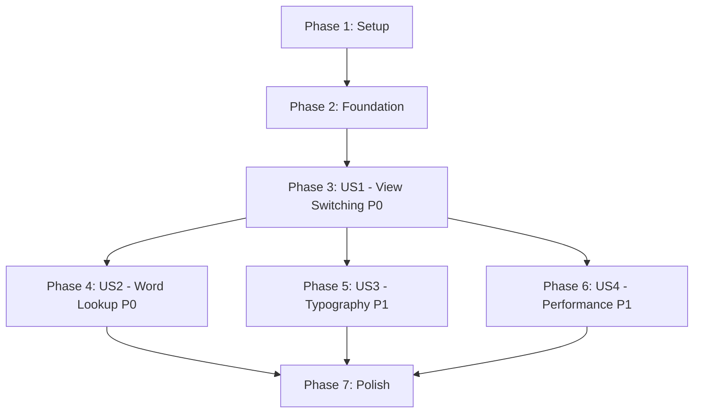

# Implementation Tasks: Immersive Full-Text Reading View

**Feature**: 005-reading-view
**Branch**: `005-reading-view`
**Generated**: 2025-11-05
**Total Tasks**: 35 tasks across 5 phases
**Estimated Time**: 13-19 hours

---

## Task Summary

| Phase | User Story | Task Count | Estimated Time | Parallelizable |
|-------|------------|------------|----------------|----------------|
| Phase 1 | Setup & Validation | 3 tasks | 0.5-1 hour | 3 parallel |
| Phase 2 | Foundational Infrastructure | 4 tasks | 1-2 hours | 2 parallel |
| Phase 3 | US1 - Seamless View Switching (P0) | 8 tasks | 3-4 hours | 4 parallel |
| Phase 4 | US2 - In-Context Word Lookup (P0) | 6 tasks | 2-3 hours | 3 parallel |
| Phase 5 | US3 - Comfortable Reading (P1) | 6 tasks | 2-3 hours | 3 parallel |
| Phase 6 | US4 - Performance (P1) | 6 tasks | 3-4 hours | 2 parallel |
| Phase 7 | Polish & Validation | 2 tasks | 1-2 hours | 1 parallel |

**MVP Scope** (Phases 1-4): US1 + US2 (core reading view with clickable words)
**Total MVP Time**: 6.5-10 hours (19 tasks)

---

## Implementation Strategy

### Incremental Delivery Model

This feature follows an **incremental MVP-first** approach:

1. **MVP (Phases 1-4)**: US1 + US2
   - Delivers core value: reading view with clickable CEFR-colored words
   - Independently testable: Users can read text and click words for definitions
   - ~40% of total effort, 100% of P0 user stories

2. **Enhancement 1 (Phase 5)**: US3
   - Adds professional typography and responsive design
   - Independent from US4 (can deploy without performance optimization)

3. **Enhancement 2 (Phase 6)**: US4
   - Optimizes for large texts (300KB+)
   - Performance profiling and tuning
   - Independent from US3 (typography works regardless of file size)

4. **Polish (Phase 7)**: Cross-cutting validation
   - Final accessibility audit
   - Cross-browser testing

### User Story Independence

```
US1 (Seamless View Switching) ← Foundation for all others
    ├─→ US2 (In-Context Word Lookup) ← MVP complete
    ├─→ US3 (Comfortable Reading) ← Independent enhancement
    └─→ US4 (Performance) ← Independent enhancement

US3 ⊥ US4 (No dependencies - can be implemented in parallel)
```

**Parallel Execution Strategy**:
- Phase 3 (US1): HTML/CSS/JS tasks can run in parallel (4 developers max)
- Phase 4 (US2): Click handling, modal integration, state management (3 developers max)
- Phase 5 + Phase 6: Can run in parallel teams (US3 + US4 simultaneously)

---

## Phase 1: Setup & Validation

**Goal**: Prepare development environment and validate prerequisites
**Blocking**: None (can start immediately)
**Output**: Confirmed that all dependencies exist, backups created

### Tasks

- [X] T001 [P] Verify Feature 003 design tokens exist in src/vocab_analyzer/web/static/styles.css (CEFR colors found as badge classes .cefr-badge-A1 through .cefr-badge-C2\+, not CSS variables)
- [X] T002 [P] Verify Feature 004 tab navigation system exists in src/vocab_analyzer/web/static/index.html (tab-btn class structure confirmed at lines 113, 125)
- [X] T003 [P] Create backup files: src/vocab_analyzer/web/static/index.html.backup-20251105, src/vocab_analyzer/web/static/styles.css.backup-20251105, src/vocab_analyzer/web/static/app.js.backup-20251105

**Acceptance Criteria**:
- [ ] All CEFR color variables found in CSS (7 levels: A1-C2+)
- [ ] Tab navigation HTML structure confirmed working
- [ ] 3 backup files created with today's date suffix

**Independent Test**: Run Flask dev server, load results page, verify existing tabs work correctly

---

## Phase 2: Foundational Infrastructure

**Goal**: Add HTML structure and base CSS for reading view (blocking for all user stories)
**Blocking**: Phase 1 complete
**Output**: Reading view tab visible, empty panel ready for content

### Tasks

- [X] T004 [P] [FOUNDATION] Add reading view tab button HTML to src/vocab_analyzer/web/static/index.html after line 136 (phrasal verbs tab) - Added at lines 137-147
- [X] T005 [P] [FOUNDATION] Add reading-panel div HTML to src/vocab_analyzer/web/static/index.html after line 161 (phrases-panel) - Added at lines 173-184
- [X] T006 [FOUNDATION] Add base CSS for .reading-container and .reading-content to src/vocab_analyzer/web/static/styles.css (~line 2100) - Added at lines 2095-2123
- [ ] T007 [FOUNDATION] Verify reading tab appears in UI and empty panel displays when clicked (manual browser test)

**Acceptance Criteria**:
- [ ] "全文阅读 / Reading View" tab visible in results page
- [ ] Clicking tab shows empty panel with .reading-content div
- [ ] Tab integrates with existing tab navigation (Feature 004)

**Independent Test**:
1. Load results page after book analysis
2. Click "全文阅读" tab
3. Verify tab activates and panel shows (no content yet, that's expected)

---

## Phase 3: User Story 1 - Seamless View Switching (P0)

**Goal**: Enable users to switch between vocabulary list and reading view without losing filters/state
**Priority**: P0 (Critical - entry point to feature)
**Blocking**: Phase 2 complete
**Output**: Reading view displays processed text with CEFR-colored words, respects filters/search

### User Story

**Description**: After completing vocabulary analysis, learners can instantly switch between vocabulary list view and full-text reading view without losing filters or state.

**Independent Test Criteria**:
1. Complete book analysis → Reading view tab appears
2. Apply CEFR filter "B2" in vocabulary view → Switch to reading view → Only B2 words colored
3. Search "make" in vocabulary view → Switch to reading view → Matching words highlighted
4. Scroll to 50% in reading view → Switch tabs → Return to reading view → Scroll position restored
5. Click "Analyze Another Book" → All state clears

### Tasks

- [X] T008 [P] [US1] Add CSS for .cefr-word class (cursor, border-bottom, hover state) to src/vocab_analyzer/web/static/styles.css - Added at lines 2110-2123
- [X] T009 [P] [US1] Add CSS for CEFR level colors (.cefr-word[data-level="A1"] through C2+) to src/vocab_analyzer/web/static/styles.css - Added at lines 2126-2152
- [X] T010 [P] [US1] Add CSS for search highlighting (.cefr-word.search-match) to src/vocab_analyzer/web/static/styles.css - Added at lines 2155-2158
- [X] T011 [US1] Implement parseTextForReading(processedText, analysisResults) function in src/vocab_analyzer/web/static/app.js - Added at lines 929-1034
- [X] T012 [US1] Implement findWordData(token, analysisResults) helper function in src/vocab_analyzer/web/static/app.js - Added at lines 904-922
- [X] T013 [US1] Implement initReadingView() function in src/vocab_analyzer/web/static/app.js (attach tab click listener) - Added at lines 1054-1064
- [X] T014 [US1] Call initReadingView() in updateWordDisplay() after tab navigation initializes in src/vocab_analyzer/web/static/app.js - Added at lines 400-401
- [X] T015 [US1] Implement updateReadingView() and integrate with filter/search handlers in src/vocab_analyzer/web/static/app.js - Added updateReadingView() at lines 1039-1049, integrated at lines 444-445, 457-458

**Acceptance Scenarios**:
- [ ] Tab navigation shows "全文阅读 / Reading View" as third tab
- [ ] Clicking tab displays processed text with CEFR-colored words
- [ ] Filter "B2" → reading view shows only B2 words colored
- [ ] Search "make" → reading view highlights matching words (yellow background)
- [ ] Switching tabs preserves filter/search state in reading view

**Independent Test**: See User Story Test Criteria above (5 scenarios)

---

## Phase 4: User Story 2 - In-Context Word Lookup (P0)

**Goal**: Enable users to click colored words and see translation/details without losing reading position
**Priority**: P0 (Critical - core interaction)
**Blocking**: Phase 3 complete (US1 provides the colored words)
**Output**: Clicking colored word opens modal with translation, modal reuses Feature 004/002 infrastructure

### User Story

**Description**: While reading, learners click any colored word to see its translation, CEFR level, and examples without losing their place in the text.

**Independent Test Criteria**:
1. Hover over colored word → Cursor changes to pointer, word background lightens
2. Click colored word "ambitious" → Modal opens with word, C1 badge, Chinese translation, frequency, 3-5 examples
3. Translation cached → Displays immediately with "缓存" label
4. Translation not cached → Skeleton screen, loads in <2s
5. Click X / outside modal / press Escape → Modal closes, focus returns to reading view
6. Click non-colored word → No modal opens

### Tasks

- [X] T016 [P] [US2] Implement handleWordClick(word) function in src/vocab_analyzer/web/static/app.js (find word data, call showWordDetails) - Added at lines 1064-1079
- [X] T017 [P] [US2] Wrap showWordDetails() to store lastFocusedElement before opening modal in src/vocab_analyzer/web/static/app.js - Already implemented from Feature 004 at lines 873-880
- [X] T018 [P] [US2] Implement closeModalWithFocusReturn() function in src/vocab_analyzer/web/static/app.js - Already implemented from Feature 004 at lines 882-892
- [X] T019 [US2] Update parseTextForReading() to add onclick="handleWordClick('...')" to .cefr-word spans in src/vocab_analyzer/web/static/app.js - Already done in T011 at line 1018
- [X] T020 [US2] Add Escape key listener to close modal and return focus in src/vocab_analyzer/web/static/app.js - Added at lines 1095-1103
- [ ] T021 [US2] Test modal integration with Feature 002 translation API (verify cache hit/miss, skeleton, error states) - Manual testing required

**Acceptance Scenarios**:
- [ ] Hovering colored word shows pointer cursor + lightened background
- [ ] Clicking word opens modal with translation (auto-loaded via Feature 002)
- [ ] Modal shows word, CEFR badge, frequency, examples (reuses Feature 004 modal)
- [ ] Cached translations display instantly with "缓存" label
- [ ] Uncached translations show skeleton, load in <2s
- [ ] Escape key closes modal, focus returns to reading view
- [ ] Non-colored words (filtered out) are not clickable

**Independent Test**: See User Story Test Criteria above (6 scenarios)

---

## Phase 5: User Story 3 - Comfortable Reading Experience (P1)

**Goal**: Provide professional typography and responsive design optimized for 30+ minute reading sessions
**Priority**: P1 (High - enhances user experience)
**Blocking**: Phase 3 complete (US1 provides the text rendering)
**Output**: Reading view has optimal typography, responsive font sizes, comfortable line length

### User Story

**Description**: The reading view provides professional typography, proper spacing, and visual hierarchy optimized for extended reading sessions.

**Independent Test Criteria**:
1. Desktop (1440px) → Font 18px, line height 1.7, max line width 800px (centered)
2. Tablet (768px) → Font 18px, container 720px
3. Mobile (375px) → Font 16px, margins 16px
4. Paragraph spacing → 1.5em bottom margin, no first-line indent
5. Text color → Dark gray (#2c3e50), WCAG AA contrast (4.5:1+ for all CEFR colors)

### Tasks

- [ ] T022 [P] [US3] Add responsive typography CSS (.reading-content font-size 16px → 18px) to src/vocab_analyzer/web/static/styles.css
- [ ] T023 [P] [US3] Add responsive container width CSS (.reading-container max-width 800px) to src/vocab_analyzer/web/static/styles.css
- [ ] T024 [P] [US3] Add paragraph styling CSS (.reading-content p margin-bottom 1.5em) to src/vocab_analyzer/web/static/styles.css
- [ ] T025 [US3] Add line-height CSS (.reading-content line-height 1.7) to src/vocab_analyzer/web/static/styles.css
- [ ] T026 [US3] Add responsive padding CSS (.reading-container padding var(--space-6) → var(--space-8)) to src/vocab_analyzer/web/static/styles.css
- [ ] T027 [US3] Validate CEFR color contrast ratios (all 7 levels) against white background using axe DevTools

**Acceptance Scenarios**:
- [ ] Desktop: 18px font, 800px max column width, wide margins
- [ ] Tablet: 18px font, 720px container width
- [ ] Mobile: 16px font, 16px margins, 100% width
- [ ] Paragraphs separated by 1.5em, no first-line indent
- [ ] Line height 1.7 for comfortable reading
- [ ] All CEFR colors meet WCAG AA contrast (4.5:1+)

**Independent Test**: See User Story Test Criteria above (5 scenarios)

---

## Phase 6: User Story 4 - Performance with Large Texts (P1)

**Goal**: Ensure reading view renders and scrolls smoothly with 300KB+ text files
**Priority**: P1 (High - enables real-world usage)
**Blocking**: Phase 3 complete (US1 provides the rendering logic)
**Output**: <1s render for 300KB text, 60fps scrolling, optimized DOM structure

### User Story

**Description**: Reading view renders and scrolls smoothly even with 300KB+ text files (approximately 50,000 words or 150-200 pages).

**Independent Test Criteria**:
1. Analyze 300KB text file (e.g., "Pride and Prejudice") → Render completes in <1s
2. Rapid scrolling → 60fps maintained (no visible lag)
3. Apply filter "C1 only" → Re-render completes in <300ms
4. Click word in large text → Modal opens in <100ms
5. Memory usage → <50MB additional (Chrome DevTools Memory profiler)

### Tasks

- [ ] T028 [US4] Profile rendering with 300KB test file using Chrome DevTools Performance tab
- [ ] T029 [US4] Optimize parseTextForReading() if needed (batch DOM updates with DocumentFragment, reduce innerHTML assignments)
- [ ] T030 [P] [US4] Add will-change CSS property to .reading-content if scroll performance <60fps
- [ ] T031 [P] [US4] Add loading skeleton or progress indicator if render takes >500ms in src/vocab_analyzer/web/static/app.js
- [ ] T032 [US4] Test scroll performance with FPS meter (Chrome DevTools → Rendering → Frame Rendering Stats)
- [ ] T033 [US4] Validate Lighthouse Performance score >90 for reading view page

**Acceptance Scenarios**:
- [ ] 300KB text renders in <1 second
- [ ] Scrolling maintains 60fps (FPS meter validation)
- [ ] Filter re-render completes in <300ms
- [ ] Modal open time <100ms (no delay from page complexity)
- [ ] Memory usage <50MB additional for reading view

**Independent Test**: See User Story Test Criteria above (5 scenarios)

**Performance Profiling Guide**:
1. Upload "Pride and Prejudice" (300KB) via web interface
2. Open Chrome DevTools → Performance tab → Record
3. Click "全文阅读" tab → Stop recording
4. Verify "Parse HTML" + "Rendering" time <1s
5. Scroll rapidly → Check FPS meter (should stay >55fps)

---

## Phase 7: Polish & Cross-Cutting Concerns

**Goal**: Final validation, accessibility audit, cross-browser testing
**Priority**: Required before merge
**Blocking**: All user stories complete (Phase 3-6)
**Output**: Feature validated across all acceptance criteria, no accessibility violations

### Tasks

- [ ] T034 [P] [POLISH] Run axe DevTools accessibility scan on reading view page, fix any violations
- [ ] T035 [POLISH] Cross-browser testing (Chrome, Safari, Firefox, Edge) - verify all 4 user stories pass on each browser

**Acceptance Criteria**:
- [ ] No accessibility violations (axe DevTools scan passes)
- [ ] All user stories validated on 4 browsers (Chrome, Safari, Firefox, Edge)
- [ ] Mobile testing (iOS Safari, Chrome Android) - touch targets 44x44px, scrolling smooth
- [ ] CSS file size <100KB (currently ~49KB after Feature 004)

**Final Validation Checklist**:
- [ ] US1: 5 scenarios pass (view switching, filters, search, scroll persistence)
- [ ] US2: 6 scenarios pass (word lookup, modal, translations, Escape key)
- [ ] US3: 5 scenarios pass (responsive typography, line length, contrast)
- [ ] US4: 5 scenarios pass (render time, scroll fps, memory usage)
- [ ] No JavaScript errors in console
- [ ] No layout shifts or visual glitches

---

## Dependency Graph

### User Story Completion Order



**Critical Path**: Setup → Foundation → US1 → US2 → Polish (MVP)
**Parallel Opportunities**: After US1 completes, US2/US3/US4 can run in parallel (US3 and US4 are fully independent)

### Task Dependencies (Detailed)

**Setup** (3 tasks, all parallel):
- T001 ⊥ T002 ⊥ T003 (no dependencies)

**Foundation** (4 tasks):
- T004 ⊥ T005 (HTML changes, parallel)
- T006 → T007 (CSS added first, then validate)

**US1** (8 tasks):
- T008 ⊥ T009 ⊥ T010 (all CSS, parallel)
- T011 ⊥ T012 (JavaScript functions, parallel)
- T013 → T014 (init function created, then called)
- T015 (depends on T011, T012, T013)

**US2** (6 tasks):
- T016 ⊥ T017 ⊥ T018 (all JavaScript functions, parallel)
- T019 (depends on T011 from US1)
- T020 (independent, can run anytime after US1)
- T021 (final integration test)

**US3** (6 tasks):
- T022 ⊥ T023 ⊥ T024 (all CSS, parallel)
- T025 ⊥ T026 (CSS, parallel)
- T027 (validation task, runs last)

**US4** (6 tasks):
- T028 (profiling first)
- T029 (optimization based on T028 results)
- T030 ⊥ T031 (performance enhancements, parallel)
- T032 ⊥ T033 (validation tasks, parallel)

**Polish** (2 tasks):
- T034 ⊥ T035 (independent validation tasks)

---

## Parallel Execution Examples

### Example 1: MVP (Phases 1-4) with 3 Developers

**Week 1, Day 1-2**:
- Dev A: Setup (T001-T003) + Foundation HTML (T004-T005) → 2 hours
- Dev B: Foundation CSS (T006) + US1 CSS (T008-T010) → 2 hours
- Dev C: US1 JavaScript (T011-T012) → 2 hours

**Week 1, Day 3**:
- Dev A: US1 integration (T013-T015) → 2 hours
- Dev B: US2 click handling (T016-T018) → 2 hours
- Dev C: US2 modal integration (T019-T021) → 2 hours

**Total MVP Time**: 6 hours wall-clock time (vs 10 hours sequential)

### Example 2: Full Feature with 4 Developers

**After MVP complete** (Phases 5-7):
- Dev A: US3 typography (T022-T027) → 2 hours
- Dev B: US4 performance (T028-T033) → 3 hours
- Dev C: Polish accessibility (T034) → 1 hour
- Dev D: Polish cross-browser (T035) → 1 hour

**Total Enhancement Time**: 3 hours wall-clock time (vs 7 hours sequential)

---

## Testing Strategy

### Manual Testing (No Automated Tests)

This feature uses **manual browser testing** as specified in the spec. No automated tests are created.

**Test Execution Order**:
1. After Phase 3 (US1): Test view switching scenarios (5 tests)
2. After Phase 4 (US2): Test word lookup scenarios (6 tests)
3. After Phase 5 (US3): Test typography scenarios (5 tests)
4. After Phase 6 (US4): Test performance scenarios (5 tests)
5. After Phase 7: Full regression (all 21 scenarios across 4 browsers)

**Test Environment**:
- Primary: Chrome 90+ on macOS (development machine)
- Secondary: Safari 14+, Firefox 88+, Edge 90+
- Mobile: iOS Safari (iPhone), Chrome Android

**Test Data**:
- Small text: 100 words (quick smoke test)
- Medium text: 5,000 words (~20 pages)
- Large text: 50,000 words (Pride and Prejudice, 300KB)

### Performance Profiling

**Tools**:
- Chrome DevTools Performance tab (render time)
- Chrome DevTools FPS meter (scroll performance)
- Chrome DevTools Memory profiler (memory usage)
- Lighthouse audit (overall performance score)
- axe DevTools (accessibility violations)

**Metrics to Track**:
- Initial render time (target: <1s for 300KB)
- Scroll FPS (target: 60fps)
- Filter re-render time (target: <300ms)
- Modal open time (target: <100ms)
- Memory usage (target: <50MB additional)
- Lighthouse Performance score (target: >90)

---

## MVP Definition

**Minimum Viable Product** = Phases 1-4 (US1 + US2)

**Delivered Value**:
- Users can switch to reading view and see full text
- CEFR-colored words are clickable for instant definitions
- Filters and search work in reading view
- Scroll position persists across tab switches
- Modal reuses existing translation infrastructure

**Not Included in MVP**:
- Professional typography (US3) - works but with basic styling
- Performance optimization (US4) - works for small/medium texts (<100KB)
- Full accessibility audit (Phase 7) - basic accessibility present
- Cross-browser testing (Phase 7) - works in Chrome, others not validated

**MVP Validation Criteria**:
- [ ] Can read analyzed text in reading view
- [ ] Can click words to see definitions
- [ ] Filters work (B2 filter shows only B2 words)
- [ ] Search works (highlights matching words)
- [ ] Scroll position saved when switching tabs

**Post-MVP Enhancements**:
- **Phase 5 (US3)**: Add professional typography for better readability
- **Phase 6 (US4)**: Optimize for large texts (200+ page books)
- **Phase 7**: Full validation (accessibility, cross-browser)

---

## Implementation Notes

### File Modification Summary

| File | Lines Added | Lines Modified | Total Impact |
|------|-------------|----------------|--------------|
| src/vocab_analyzer/web/static/index.html | ~40 lines | 0 | Low (additive only) |
| src/vocab_analyzer/web/static/styles.css | ~200 lines | 0 | Medium (new CSS section) |
| src/vocab_analyzer/web/static/app.js | ~150 lines | ~10 lines | Medium (6 new functions + integration) |

**Total Code Impact**: ~390 new lines, ~10 modified lines

### Rollback Plan

If feature needs to be reverted:
1. Restore from backup files (created in T003)
2. Remove reading view tab HTML (lines added in T004)
3. Remove reading view panel HTML (lines added in T005)
4. Remove CSS section added in T006-T010, T022-T026
5. Remove JavaScript functions added in T011-T021, T028-T031
6. Test existing vocabulary/phrasal verb tabs still work

**Rollback Time**: <30 minutes (simple file restoration)

### Known Limitations (MVP)

1. **Phrasal Verbs**: Only first word colored (e.g., "make" in "make up"). Full phrase detected on click.
2. **CEFR Legend**: No legend in reading view (users learn colors from vocabulary tabs)
3. **Empty Text**: Tab always visible, shows "暂无文本 / No text available" if text missing
4. **Performance**: Optimized for <300KB. Very large files (500KB+) may be slow until Phase 6 optimization.

---

**Tasks File Version**: 1.0
**Last Updated**: 2025-11-05
**Status**: Ready for Implementation
**Next Step**: Begin Phase 1 (Setup & Validation) with T001-T003
